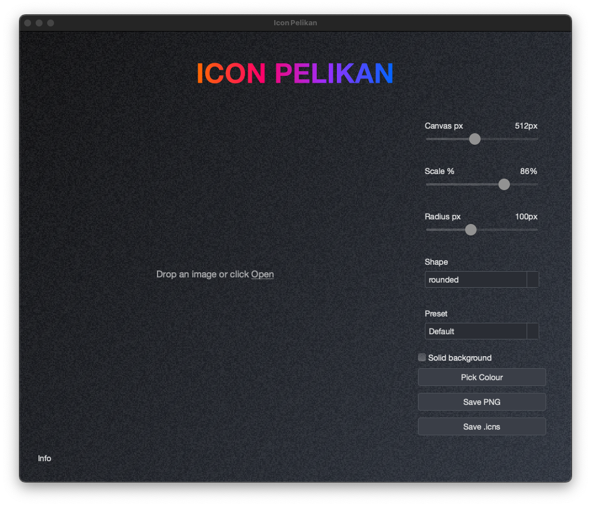

# Icon Pelikan

*A brutalist, grain‑textured and ultra‑minimal Mac‑style generator that turns **any** square image into beautiful app icons in seconds.*

 <!--‑‑ replace with your own screenshot –-->

---

## ✨ Key Features
| Area | Details |
|------|---------|
| **Instant Preview** | Drag‑and‑drop or open an image file and watch the live preview update with smooth fade‑in animation. |
| **Canvas Controls** | • Canvas size 128 – 1024 px  • Image scale slider 50 – 100 %  • Corner radius 0 – 256 px |
| **Shapes** | Rounded‑square or perfect circle masks. |
| **Backgrounds** | Transparent by default or pick any solid colour with the integrated colour‑picker. |
| **Presets** | One‑click presets for macOS, iOS, circle, square & default layouts. |
| **Exports** | • **PNG** (any platform)  • **.iconset + .icns** bundles via macOS **`iconutil`** |
| **UX Extras** | Animated rainbow title, grainy radial gradient backdrop, flat dark‑theme widgets, subtle value labels next to sliders. |
| **Packaging** | Ships with a **PyInstaller** recipe for “double‑clickable” macOS `.app` bundles. |

---

## 🖥️ Quick Start

```bash
# 1 · Clone
git clone https://github.com/YOUR‑USERNAME/icon‑pelikan.git
cd icon‑pelikan

# 2 · Create & activate a virtual env  (Python ≥ 3.10 recommended)
python -m venv .venv
source .venv/bin/activate  # Windows: .venv\Scripts\activate

# 3 · Install runtime deps
pip install -r requirements.txt

# 4 · Run the app
python main.py
```

The main window will open with a drag‑and‑drop hint.  
Drop any **PNG/JPEG/WEBP/TIFF/BMP** or click **Open** to choose a file.

---

## 🗺️ Application Layout

```
┌───────────────────────────────────────────────────────────────┐
│           ICON PELIKAN  ← animated rainbow header            │
├─────────────────────────────────────────────┬────────────────┤
│                                             │  Canvas px ■  │
│  [live image preview + grainy backdrop]      │  Scale %   ■  │
│                                             │  Radius px ■  │
│                                             │  Shape ▲▼     │
│                                             │  Preset ▲▼    │
│                                             │  ☐ Solid BG   │
│                                             │  Pick Colour  │
│                                             │  Save PNG     │
│                                             │  Save .icns   │
│                                             │               │
└─────────────────────────────────────────────┴────────────────┘
```

---

## 📦 Packaging (macOS · Windows · Linux)

### macOS (`.app` bundle)

Create a self‑contained `.app` bundle with [PyInstaller](https://pyinstaller.org):

```bash
pip install pyinstaller
pyinstaller \
  --noconsole \
  --windowed \
  --name "Icon Pelikan" \
  --icon assets/icon_pelikan.icns \
  main.py
```

The finished bundle lives in `dist/Icon Pelikan.app`.  
Drag it into **/Applications** (optionally codesign & notarise) and it should just work™.

### Windows (`.exe` launcher)

```bash
pip install pyinstaller
pyinstaller ^
  --noconsole ^
  --windowed ^
  --name "Icon Pelikan" ^
  --icon assets\\icon_pelikan.ico ^
  main.py
```

The final `Icon Pelikan\\Icon Pelikan.exe` can be zipped or installed with *Inno Setup*.

### Linux (AppImage)

```bash
pip install pyinstaller
pyinstaller --noconsole --windowed --name "icon-pelikan" main.py
# Optional: wrap the resulting folder into an AppImage with appimagetool
```

All three commands create a **single‑folder `dist/` directory** containing everything needed to run the app on the target OS.

---

## 🍏 Exporting Apple Icons

`Save .icns` creates:

1. A temporary **\<name\>.iconset** folder with all required PNG sizes *(16 → 1024 px @1× & @2×)*.
2. Runs the macOS tool **`iconutil -c icns`** to convert that folder to a single **.icns** file.

> **Requirements:** macOS with **Xcode Command‑Line Tools** installed (`xcode-select --install`).

On other platforms the button is disabled.

---

## 🏗️ Project Structure

| Path | Purpose |
|------|---------|
| `main.py` | PySide6 GUI – widgets, layouts, gradients & event wiring |
| `icon_processor.py` | Pure‑Pillow helpers for masking, scaling and Apple icon exports |
| `assets/` | App icon, noise texture and optional screenshots |
| `requirements.txt` | Minimal runtime dependencies |
| `dist/` | *(ignored)* output folder produced by PyInstaller |

---

## 🤖 Implementation Highlights

* **Qt Layouts** – Responsive vertical/horizontal boxes keep controls tidy on resize.
* **ChromaticNoiseWidget** – Custom `QWidget` that paints a radial gradient + static grain `QPixmap`.
* **StaticGradientLabel** – Renders the header using a multicolour linear gradient inside a `QPainterPath`.
* **Smooth Fade‑In** – New previews cross‑fade via `QGraphicsOpacityEffect` and a 250 ms `QPropertyAnimation`.
* **Pillow + NumPy‑free** – Image processing sticks to stock Pillow; no heavyweight SciPy stack needed.

---

## 👩‍💻 Development Mode

```bash
# lint + style checks
pip install ruff black
ruff check .
black --check .

# run automatic tests (todo)
pytest
```

---

## 🙌 Contributing

Pull requests are welcome! Please:

1. Fork the project, create a branch.
2. Follow existing code‑style (`black`, 120 chars, type hints).
3. Update docs / screenshots if the UI changes.
4. Submit a concise PR describing *what* & *why*.

---

## 📝 License

### Source code

Released under the **Polyform Noncommercial License 1.0.0**.  
➟ **Free** for personal, academic & internal business use.  
➟ **Contact the author** for a commercial license if you intend to ship this code inside a paid product or cloud service.

### Icons you generate

The PNG/.icns files you export with Icon Pelikan are **yours**. Feel free to use them in commercial apps, marketing material and client projects—no attribution required.

---

## ✍️ Author

**Ricardo Kupper** – [gambadio@adalala.com](gambadio@adalala.com)

